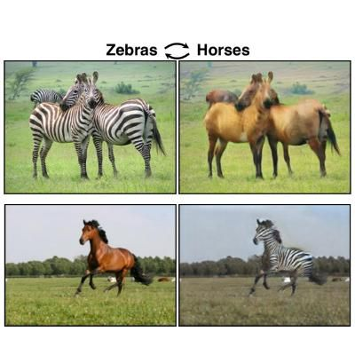

# SAMSUNGxKAIST-AI (07/31 과제)

## 과제 설명

이번 과제는 horse2zebra Dataset을 사용하여 CycleGAN을 학습시키는 것입니다.

다음은 horse2zebra Dataset의 예시 사진입니다.

과제를 하는 순서는 다음과 같습니다.

1. download_cyclegan_dataset.sh 과 cyclegan_horse2zebra_assign.ipynb 을 같은 폴더에 받습니다.
2. cyclegan_horse2zebra_assign.ipynb 의 ???인 부분을 채웁니다.
3. 채운 ipynb의 모든 셀을 순서대로 실행합니다. (학습시간은 약 1시간 정도 걸릴 것으로 예상됩니다.)
4. 코드를 실행시키면 생성되는 logs 폴더에 변환된 이미지들이 저장되는 것을 확인합니다.

추가로 저번 실습에 사용했던 코드들을 다시 다운로드 받고 싶은 분들은 다음 링크를 참고하시면 될 것 같습니다.

https://drive.google.com/open?id=1VEPpKC-1aA84aAH_cj7-ZSpAncU4ebG4

## 제출

ipynb 파일이 들어있는 폴더를 모두 압축하여 psh01087@gmail.com 로 보내주세요.

### 2019 / 08 / 06 수정사항

코드에 아래와 같은 문제가 있었음을 발견하였습니다. detach()는 D를 학습시키는 동안 G의 학습은 진행되지 않도록 해주기 위해 D의 학습에서만 있어야하는 코드이나, G의 학습에도 섞여들어가 학습에 문제가 있었습니다. 오류발견에 도움을 주신 한창호님에게 감사인사를 드립니다.

오류가 뒤늦게 발견된 관계로 과제 기한은 12일까지로 하루 더 드리도록 하겠습니다. 죄송합니다.

₩₩₩ python

        # Translate from X to Y, check D_Y output
        G_out = G(X)
        D_Y_out = D_Y(G_out)  # 수정전 : D_Y_out = D_Y(G_out.detach())
        G_gan_loss = mse_criterion(D_Y_out, torch.ones_like(D_Y_out).to(device))
        
        # Translate from Y to X, check D_X output
        F_out = F(Y)
        D_X_out = D_X(F_out)  # 수정전 : D_X_out = D_X(F_out.detach())
        F_gan_loss = mse_criterion(D_X_out, torch.ones_like(D_X_out).to(device))
        
₩₩₩
